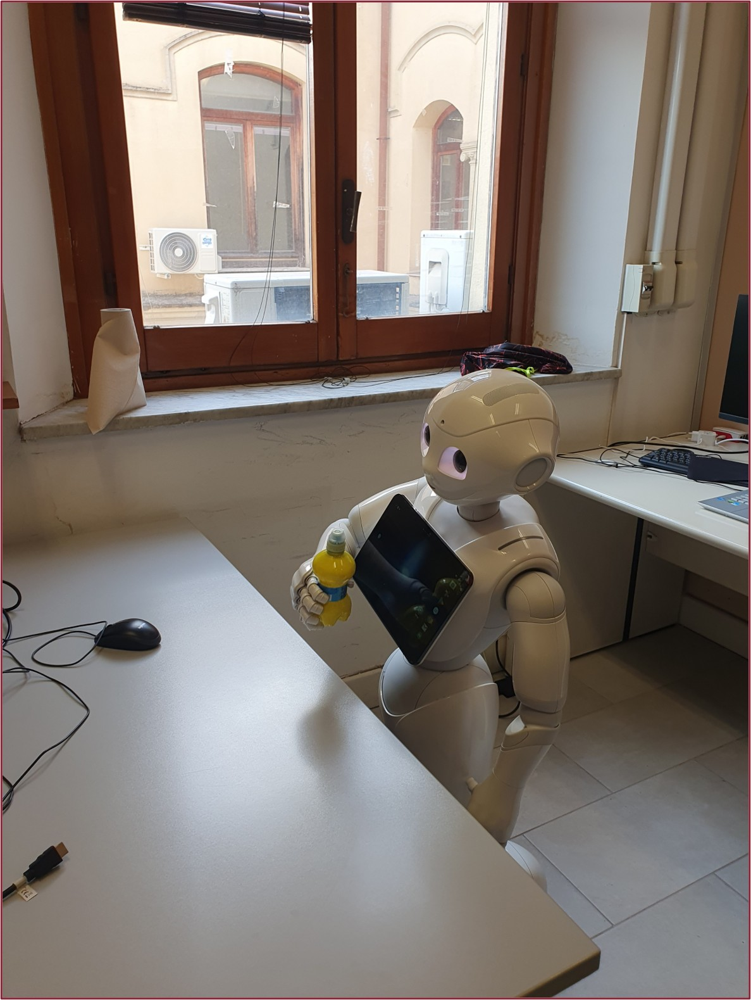
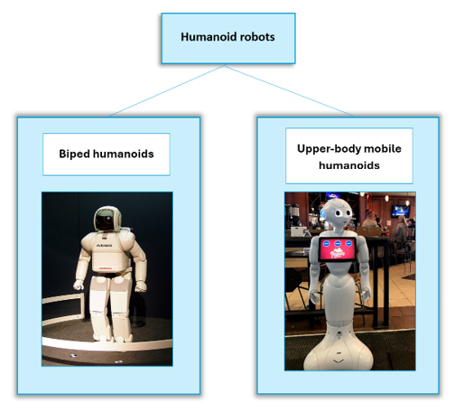
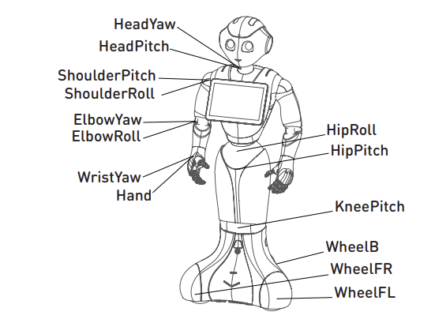
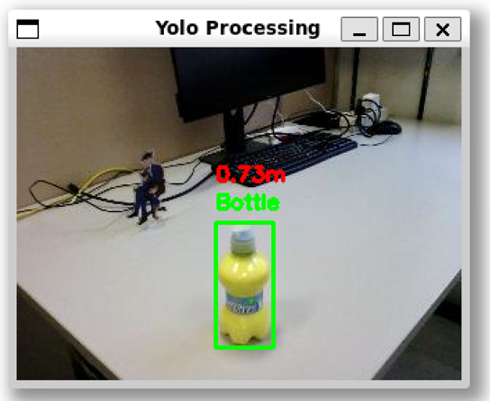
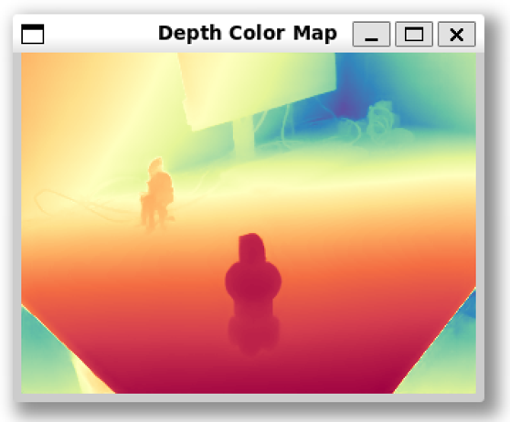
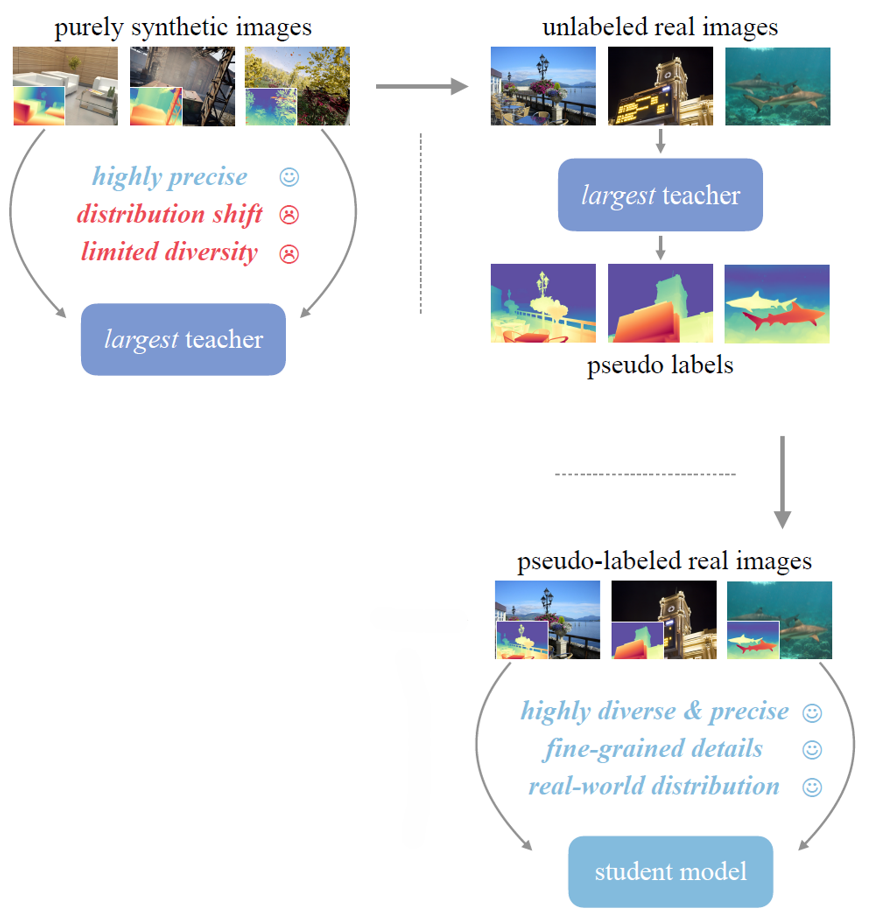
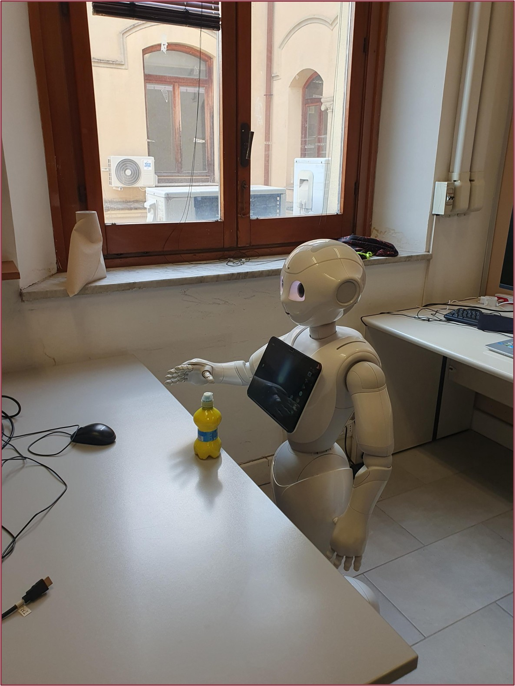
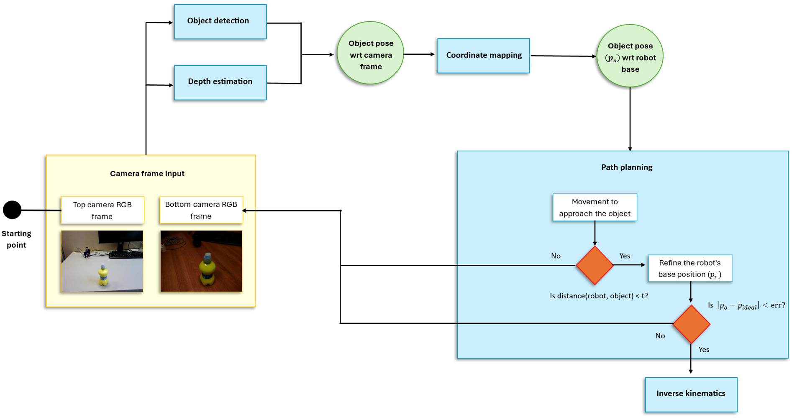
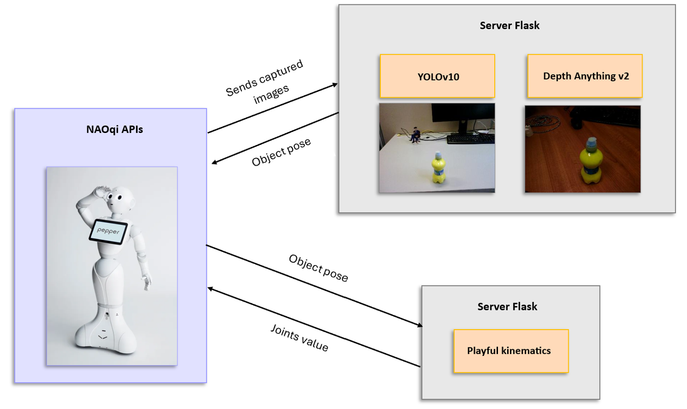
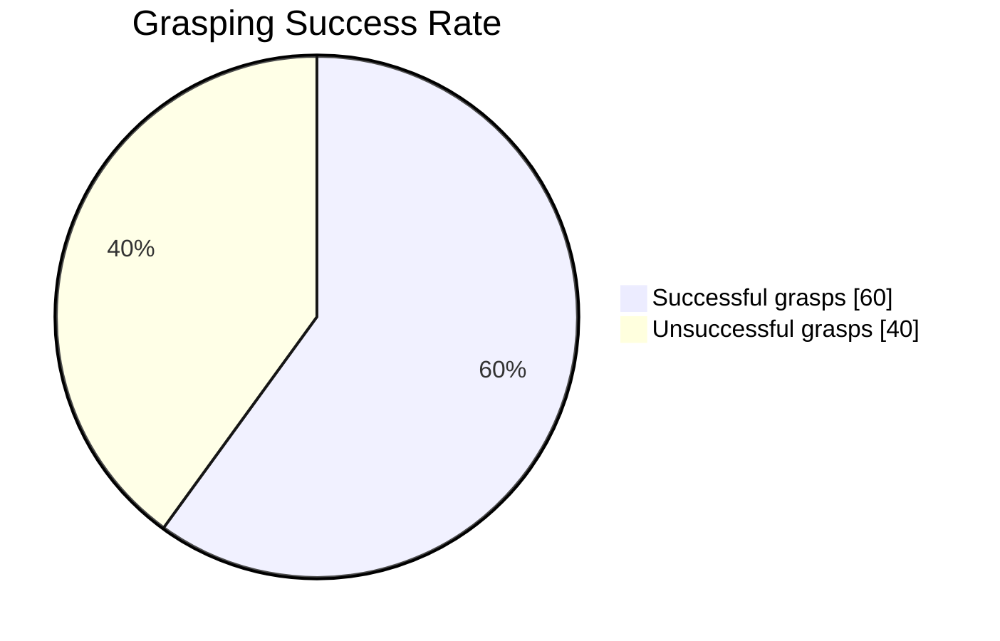

# 🤖 Design and Implementation of a Novel Grasping System for a Humanoid Robot  

  
  
  
  

---

## 📌 Overview  
This repository presents the **Master’s Thesis Project**:  
**“Design and Implementation of a Novel Grasping System for a Humanoid Robot”**,  
developed to enable **Pepper**, a humanoid robot by SoftBank Robotics, to **grasp unknown objects** without relying on external markers or additional sensors.  

The system combines **state-of-the-art computer vision** with **robotic motion planning**:  
- 🟦 **YOLO (You Only Look Once)** → real-time object detection.  
- 🟩 **Depth Anything** → monocular depth estimation for 3D perception.  
- 🟥 **Inverse Kinematics** → precise arm movement planning for grasp execution.  

Unlike traditional approaches, this work **excludes the use of fiducial markers, external depth sensors, or motion trackers**, relying solely on Pepper’s built-in cameras and actuators.  

---

## 🎯 Objectives  
- ✅ Enable Pepper to **detect and localize unknown objects** in its environment.  
- ✅ Estimate **distance and depth** using monocular vision.  
- ✅ Compute **inverse kinematics** to position the end-effector.  
- ✅ Execute grasping using Pepper’s **limited hand control** (open/close).  
- ✅ Achieve the above **within Pepper’s hardware and software constraints**.  

  

---

## 🦾 Background & Motivation  
Humans rely on **sight, touch, and proprioception** for grasping. Robots, however, depend on **cameras and sensors**. Grasping is particularly challenging for humanoid robots, where constraints in hardware and control limit precision.  

Humanoid robots are designed to **support or replace human tasks** in various fields, from assistance to entertainment.  
We distinguish between:  
- 🚶 **Biped humanoids** – full-body robots with arms and legs.  
- 🛞 **Upper-body mobile humanoids** – wheeled robots with torso, head, and arms.  

👉 Pepper belongs to the **second category**. 

  

---

## 🤖 Pepper Robot – Technical Specifications  
Pepper is a **humanoid robot** developed by **SoftBank Robotics** (formerly Aldebaran Robotics).  

### 📏 Physical Characteristics  
- Height: ~1.20 m  
- Mobility: **3-wheeled omnidirectional base**  
- Degrees of Freedom (DoF): **20 total**, with **5 per arm**  

### 👀 Vision System  
- 2 × RGB cameras (**640×480**) → located in mouth & forehead  
- Optional: stereo cameras or 3D depth sensor (our version: **stereo cameras**)  
- Frame rate: **15 fps @ 10 Hz** (non-simultaneous usage of the two RGB cameras)  

### 🖐 Hand & Sensors  
- Fingers: **cannot move individually** → hand is only fully open/closed  
- Max payload: **200 g**  
- Capacitive sensors → **upper part of the hands only**  

### 🧠 Embedded System  
- OS: **NAOqi 2.9**  
- Processor: **low-performance CPU**  
- Built-in gyroscopes & lasers (not used in this project)  
- Depth map reconstruction from stereo → **not precise with NAOqi API**  

  

---

# ⚙️ System Architecture  

The grasping system is structured into **five interconnected modules**, each responsible for a critical step in enabling Pepper to detect, localize, and grasp objects.  

---

## 🧩 System Modules  

### 1. 🟦 Object Detection  
- **Task**: Identifies the target object within images captured by Pepper’s cameras.  
- **Method**:  
  - Extracts the **bounding box** that defines the object’s location in the 2D image.  
  - Utilizes **YOLOv10-small** for efficient real-time detection.  
- **Output**: Bounding box coordinates → input for depth estimation.  

  

---

### 2. 🟩 Depth Estimation  
- **Task**: Estimates per-pixel depth from a single RGB image.  
- **Method**:  
  - Input: **Image (h × w × 3)** captured by Pepper’s camera.  
  - Output: **Depth map (h × w)** representing estimated distance of each pixel.  
  - Model used: **Depth Anything V2** (monocular-based, not multi-view).  
- **Notes**:  
  - Stereo cameras were discarded due to **calibration issues** and **poor depth maps**.  
  - Monocular estimation proved **more robust** and effective.

  

#### 🔍 How Depth Anything V2 Works  
Depth Anything V2 employs a **teacher-student training strategy**:  
1. 🧑‍🏫 **Teacher model** trained exclusively on **high-quality synthetic datasets**.  
2. 🖼 Teacher generates **pseudo-realistic depth labels** for a large set of **unannotated real images**.  
3. 🎓 **Student models** are then trained on these pseudo-labeled datasets, allowing them to **generalize to real-world scenarios**.  

  

---

### 3. 🟥 Coordinate Mapping  
- **Task**: Converts 2D object coordinates (image frame) into **3D coordinates relative to the robot base**.  
- **Output**: Object pose expressed in the robot’s coordinate system.  

---

### 4. 🟨 Path Planning  
- **Task**: Generates a **feasible trajectory** for Pepper’s manipulator to reach the target object.  
- **Method**: Iteratively adjusts Pepper’s base and arms until the object pose aligns with an **ideal grasp pose** within an acceptable error margin.  

---

### 5. 🟪 Inverse Kinematics  
- **Task**: Computes joint configurations to move Pepper’s end-effector (hand) to the desired pose.  
- **Framework**: **Playful Kinematics**  
  - Based on **Cyclic Coordinate Descent (CCD)**.  
  - Extends Pepper’s arm workspace by incorporating **3 lower-body DoF** in addition to the **5 DoF of the arm**.  
  - Provides greater flexibility and reach.  

  

---

## 🔄 Module Workflow  

To illustrate the complete process, consider grasping a **bottle**:  

  

1. 📷 **Image capture** → Pepper’s forehead camera acquires a real-time RGB frame.  
2. 🔍 **Object detection + Depth estimation** → YOLOv10 detects bounding box, Depth Anything V2 generates depth map.  
3. 📐 **Pose estimation** → Combination of bounding box + depth map gives 3D pose relative to camera.  
4. 🗺 **Coordinate mapping** → Converts camera coordinates to robot base frame.  
5. 🛣 **Path planning** → Plans trajectory towards the object.  
   - If the robot is **too far**, Pepper approaches iteratively.  
   - If the error **|po – pideal| < ε**, path planning ends.  
6. ⚙️ **Inverse Kinematics** → Calculates joint angles.  
7. ✋ **Execution** → Pepper closes its hand to grasp the object.  

---

## 🖥 System Execution Environment  

The five modules are implemented in **Python** and executed on an **external computer** instead of Pepper’s onboard processor, due to computational limitations.  

### 💻 Hardware  
- Laptop with:  
  - **Intel Core i9 CPU**  
  - **NVIDIA RTX 4060 GPU**  

### 🧩 Software Components  
The system relies on communication between **three main components**:  

1. **NAOqi APIs**  
   - Pepper’s OS: **NAOqi 2.9** (Android-based).  
   - Issue: NAOqi 2.9 **does not allow direct low-level access** to sensors/actuators.  
   - Workaround: Access **NAOqi 2.5 APIs** via a gateway.  

2. **First Flask Server**  
   - Runs **YOLOv10** and **Depth Anything V2**.  
   - Offloads heavy GPU computation (object detection & depth estimation).  

3. **Second Flask Server**  
   - Runs **Playful Kinematics** (requires **Ubuntu environment**).  
   - Developed on **Windows** → executed via **WSL (Windows Subsystem for Linux)**.  
   - Results retrieved and integrated with the main control pipeline.  

  

---

# 📊 Experimental Evaluation  

To assess the **performance of the grasping system**, we carried out a structured experimental campaign. The evaluation focused on verifying whether Pepper could **detect, approach, and grasp a bottle** under different environmental lighting conditions.  

---

## 🏗 Experimental Setup  

Two distinct environments were selected for the tests:  

1. 🏢 **Room 1 – Laboratory Room**  
   - Equipped with computers and large desks.  
   - Large window providing **natural daylight**.  

2. 💡 **Room 2 – Windowless Room**  
   - No windows.  
   - Illuminated exclusively by **artificial light**.  

---

## ✅ Definition of Success  

- **Successful grasp**: Pepper is able to **reach and lift the bottle**.  
- **Unsuccessful grasp**: Pepper is **unable to grasp or lift** the bottle.  

---

## 🔬 Test Procedure  

- **Total trials**: 30  
  - 15 trials in Room 1  
  - 15 trials in Room 2  
- Robot starts from **different initial positions** in each trial.  
- Each trial evaluated as **success** or **failure**.  

---

## 📈 Results  

- **Overall success rate**: **60%**  
- **Room-specific performance**:  
  - 🌞 Room 1 (natural light): lower success rate.  
  - 💡 Room 2 (artificial light): **66% success rate**.  
- **Observation**: Even in Room 1, when switching to **artificial light**, performance improved, approaching the values obtained in Room 2.  

## 🎥 Presentation & Demo

🔗 Click the links below to explore more about the project:

- 📑 **[Presentation Slides](https://docs.google.com/presentation/d/1EJujSecxnaCC-kSzfm5FOhciKeTwFtNl/edit?usp=sharing&ouid=117738060118821650757&rtpof=true&sd=true)**  
  Detailed slides of the Master’s Thesis defense with figures, diagrams, and explanations.

- 🤖 **[Video Demo](https://drive.google.com/file/d/1UbjEK2q23-L9A1yrh2Lw8b6iSbi918Xi/view?usp=sharing)**  
  A complete demonstration of the grasping system implemented on the Pepper humanoid robot.

## Authors
- [@Pnlalessio](https://github.com/Pnlalessio)  

---

## 📚 References

- VisionLab. *Research laboratory of the Department of Computer Science at the Sapienza University of Rome, Italy*.

- Bauer, Z., Escalona, F., Cruz, E., Cazorla, M., & Gomez-Donoso, F. (2019). Refining the Fusion of Pepper Robot and Estimated Depth Maps Method for Improved 3D Perception. *IEEE Access*.

- Yoshida, E. (2018). Robots that look like humans: A brief look into humanoid robotics. *Metode*.

- Siciliano, B., & Khatib, O. (Eds.). (2016). *Springer Handbook of Robotics*. Springer.

- Craig, J. J. (2005). *Introduction to Robotics: Mechanics and Control* (3rd ed.). Pearson Prentice Hall.

- Murray, R. M., Li, Z., & Sastry, S. S. (1994). *A Mathematical Introduction to Robotic Manipulation*. CRC Press.

- Spong, M. W., Hutchinson, S., & Vidyasagar, M. (2020). *Robot Modeling and Control* (2nd ed.). Wiley.

- Siciliano, B., Sciavicco, L., Villani, L., & Oriolo, G. (2009). Robotics: Modelling, planning and control. *Advanced Textbooks in Control and Signal Processing*.

- Buss, S. (2004). Introduction to inverse kinematics with Jacobian transpose, pseudoinverse and damped least squares methods. *IEEE*.

- Sciavicco, L., & Siciliano, B. (2000). Modelling and Control of Robot Manipulators. *Measurement Science and Technology*.

- Whitney, D. E. (1972). The Mathematics of Coordinated Control of Prosthetic Arms and Manipulators. *Journal of Dynamic Systems, Measurement, and Control*.

- Nakamura, Y. (1990). *Advanced Robotics: Redundancy and Optimization*. Addison-Wesley.

- Rosheim, M. E. (1994). *Robot Evolution: The Development of Anthrobotics*. John Wiley & Sons.

- Rosheim, M. E. (2006). *Leonardo's Lost Robots*. Springer.

- Hornyak, T. N. (2006). *Loving the Machine: The Art and Science of Japanese Robots*. Kodansha International.

- Kato, I., Ohteru, S., Kobayashi, H., Shirai, K., & Uchiyama, A. (1974). Information-Power Machine with Senses and Limbs. *On Theory and Practice of Robots and Manipulators: Volume I*.

- Setiawan, S. A., Yamaguchi, J., Hyon, S. H., & Takanishi, A. (1999). Physical interaction between human and a bipedal humanoid robot—realization of human-follow walking. *IEEE International Conference on Robotics and Automation*.

- Akhtaruzzaman, M. (2010). Advancement of Android and Contribution of Various Countries in the Research and Development of the Humanoid Platform. *cscjournals.org*.

- Hirai, K., Hirose, M., Haikawa, Y., & Takenaka, T. (1998). The development of Honda humanoid robot. *IEEE International Conference on Robotics and Automation*.

- Dong, M., & Zhang, J. (2023). A review of robotic grasp detection technology. *Robotica*.

- Hirai, K., Hirose, M., Haikawa, Y., & Takenaka, T. (2001). Development of the Honda Humanoid Robot ASIMO. *IEEE/RSJ International Conference on Intelligent Robots and Systems (IROS)*.

- Kaneko, K., Kanehiro, F., Kajita, S., Hirukawa, H., Kawasaki, T., Hirata, M., Akachi, K., & Isozumi, T. (2004). Humanoid robot HRP-2. *IEEE International Conference on Robotics and Automation*.

- Kajita, S., Kanehiro, F., Kaneko, K., Fujiwara, K., Harada, K., Yokoi, K., & Hirukawa, H. (2003). Biped walking pattern generation by using preview control of zero-moment point. *IEEE International Conference on Robotics and Automation*.

- Ogura, Y., Aikawa, H., Shimomura, K., Kondo, H., Morishima, A., Lim, H.-O., & Takanishi, A. (2006). Development of a new humanoid robot WABIAN-2. *IEEE International Conference on Robotics and Automation*.

- Englsberger, J., Werner, A., Ott, C., Henze, B., Roa, M. A., Garofalo, G., Burger, R., Beyer, A., Eiberger, O., Schmid, K., & Albu-Schäffer, A. (2014). Overview of the torque-controlled humanoid robot TORO. *IEEE-RAS Int. Conf. Humanoid Robots*.

- Park, I.-W., Kim, J.-Y., Lee, J., & Oh, J.-H. (2007). Mechanical design of the humanoid robot platform, HUBO. *Advanced Robotics*.

- Metta, G., Sandini, G., Vernon, D., Natale, L., & Nori, F. (2008). The iCub humanoid robot: An open platform for research in embodied cognition. *PerMIS Workshop*.

- Stasse, O., Flayols, T., Budhiraja, R., Giraud-Esclasse, K., Carpentier, J., Mirabel, J., Del Prete, A., Souères, P., Mansard, N., Lamiraux, F., Laumond, J.-P., Marchionni, L., Tome, H., & Ferro, F. (2017). TALOS: A new humanoid research platform targeted for industrial applications. *IEEE-RAS International Conference on Humanoid Robotics*.

- Ishida, T. (2004). Development of a small biped entertainment robot QRIO. *IEEE/RSJ International Conference on Intelligent Robots and Systems (IROS)*.

- Gouaillier, D., Hugel, V., Blazevic, P., Kilner, C., Monceaux, J., Lafourcade, P., Marnier, B., Serre, J., & Maisonnier, B. (2008). The NAO humanoid: a combination of performance and affordability. *CoRR*.

- Kanda, T., Ishiguro, H., Ono, T., Imai, M., & Nakatsu, R. (2002). Development and evaluation of an interactive humanoid robot "Robovie". *IEEE International Conference on Robotics and Automation*.

- Kanda, T., Hirano, T., Eaton, D., & Ishiguro, H. (2004). Interactive Robots as Social Partners and Peer Tutors for Children: A Field Trial. *Human Computer Interaction (Special Issue on Human-Robot Interaction)*.

- Kanda, T., Shimada, M., & Koizumi, S. (2012). Children learning with a social robot. *HRI'12 - Proceedings of the 7th ACM/IEEE International Conference on Human-Robot Interaction*.

- Shiomi, M., Kanda, T., Ishiguro, H., & Hagita, N. (2007). Interactive Humanoid Robots for a Science Museum. *IEEE Intelligent Systems*.

- Kanda, T., Shiomi, M., Miyashita, Z., Ishiguro, H., & Hagita, N. (2009). An affective guide robot in a shopping mall. *4th ACM/IEEE International Conference on Human-Robot Interaction (HRI)*.

- Sabelli, A., & Kanda, T. (2016). Robovie as a Mascot: A Qualitative Study for Long-Term Presence of Robots in a Shopping Mall. *International Journal of Social Robotics*.

- Asfour, T., Berns, K., Dillmann, R., & Forschungszentrum Karlsruhe. (2004). The humanoid robot ARMAR: Design and control. *IEEE/RSJ International Conference on Intelligent Robots and Systems (IROS)*.

- Asfour, T., Regenstein, K., Azad, P., Schroder, J., Bierbaum, A., Vahrenkamp, N., & Dillmann, R. (2007). ARMAR-III: An integrated humanoid platform for sensory-motor control. *IEEE-RAS International Conference on Humanoid Robots*.

- Cohen, B. J., Chitta, S., & Likhachev, M. (2010). Search-based planning for manipulation with motion primitives. *IEEE International Conference on Robotics and Automation*.

- van den Berg, J., Miller, S., Goldberg, K., & Abbeel, P. (2010). Gravity-Based Robotic Cloth Folding. *Springer Tracts in Advanced Robotics*.

- Tanaka, F., Isshiki, K., Takahashi, F., Uekusa, M., Sei, R., & Hayashi, K. (2015). Pepper learns together with children: Development of an educational application. *IEEE-RAS International Conference on Humanoid Robots*.

- Gardecki, A., Podpora, M., Beniak, R., & Klin, B. (2018). The Pepper Humanoid Robot in Front Desk Application. *Progress in Applied Electrical Engineering (PAEE)*.

- Mishra, D., Arroyo Romero, G., Pande, A., Nachenahalli Bhuthegowda, B., Chaskopoulos, D., & Shrestha, B. (2024). An Exploration of the Pepper Robot’s Capabilities: Unveiling Its Potential. *Applied Sciences*.

- Vijay, C. R., Dakkshesh, G., Santhanu, J., Rangesh, S. R. B., & Ramkumar, A. (2023). Human Robot Interaction with Nao. *2nd International Conference on Advancements in Electrical, Electronics, Communication, Computing and Automation (ICAECA)*.

- Iwasaki, M., Yamazaki, A., Yamazaki, K., Miyazaki, Y., Kawamura, T., & Nakanishi, H. (2024). Perceptive Recommendation Robot: Enhancing Receptivity of Product Suggestions Based on Customers’ Nonverbal Cues. *Biomimetics*.

- Misaroș, M., Stan, O. P., Enyedi, S., Stan, A., Donca, I., & Miclea, L. C. (2024). A Method for Assessing the Reliability of the Pepper Robot in Handling Office Documents: A Case Study. *Biomimetics*.

- Ghiță, A. Ș., Gavril, A. F., Nan, M., Hoteit, B., Awada, I. A., Sorici, A., Mocanu, I. G., & Florea, A. M. (2020). The AMIRO Social Robotics Framework: Deployment and Evaluation on the Pepper Robot. *Sensors*.

- Mittendorfer, P., Yoshida, E., Moulard, T., & Cheng, G. (2013). A general tactile approach for grasping unknown objects with a humanoid robot. *IEEE/RSJ International Conference on Intelligent Robots and Systems*.

- Vicente, P., Jamone, L., & Bernardino, A. (2017). Towards markerless visual servoing of grasping tasks for humanoid robots. *IEEE International Conference on Robotics and Automation (ICRA)*.

- Claudio, G., Spindler, F., & Chaumette, F. (2016). Vision-based manipulation with the humanoid robot Romeo. *IEEE-RAS International Conference on Humanoid Robots*.

- Meeussen, W., Wise, M., Glaser, S., Chitta, S., McGann, C., Mihelich, P., Marder-Eppstein, E., Muja, M., Eruhimov, V., Foote, T., Hsu, J., Rusu, R. B., Marthi, B., Bradski, G., Konolige, K., Gerkey, B., & Berger, E. (2010). Autonomous door opening and plugging in with a personal robot. *IEEE International Conference on Robotics and Automation*.

- Morales, A., Asfour, T., Azad, P., Knoop, S., & Dillmann, R. (2006). Integrated Grasp Planning and Visual Object Localization For a Humanoid Robot with Five-Fingered Hands. *IEEE/RSJ International Conference on Intelligent Robots and Systems*.

- Do, M., Romero, J., Kjellström, H., Azad, P., Asfour, T., Kragic, D., & Dillmann, R. (2009). Grasp recognition and mapping on humanoid robots. *IEEE-RAS International Conference on Humanoid Robots*.

- Chen, H. (2022). Target Positioning and Grasping of NAO Robot Based on Monocular Stereo Vision. *Mobile Information Systems*.

- Jin, Y., Shi, Z., Xu, X., Wu, G., Li, H., & Wen, S. (2023). Target Localization and Grasping of NAO Robot Based on YOLOv8 Network and Monocular Ranging. *Electronics*.

- Müller, J., Frese, U., Röfer, T., Gelin, R., & Mazel, A. (2014). GRASPY - Object Manipulation with NAO. *Gearing Up and Accelerating Cross-fertilization between Academic and Industrial Robotics Research in Europe*.

- Silva, J., Simão, M., Mendes, N., & Neto, P. (2019). Navigation and obstacle avoidance: a case study using Pepper robot. *IEEE Industrial Electronics Society Conference (IECON)*.

- Ardón, P., Dragone, M., & Erden, M. S. (2018). Reaching and Grasping of Objects by Humanoid Robots Through Visual Servoing. *EuroHaptics*.

- Gouaillier, D., Hugel, V., Blazevic, P., Kilner, C., Monceaux, J., Lafourcade, P., Marnier, B., Serre, J., & Maisonnier, B. (2009). Mechatronic design of NAO humanoid. *IEEE International Conference on Robotics and Automation*.

- Azagra, P., Lasaosa, Á., & Gutiérrez, R. (2020). ROS stack for Pepper robot. *Journal of Open Source Software*.

- Pot, E., Monceaux, J., Gelin, R., & Maisonnier, B. (2009). Choregraphe: a graphical tool for humanoid robot programming. *Robotica*.

- Quigley, M., Conley, K., Gerkey, B., Faust, J., Foote, T., Leibs, J., Wheeler, R., & Ng, A. Y. (2009). ROS: an open-source Robot Operating System. *ICRA Workshop on Open Source Software*.

- Nakamura, Y., Hanafusa, H., & Yoshikawa, T. (1987). Task-Priority Based Redundancy Control of Robot Manipulators. *The International Journal of Robotics Research*.

- Buss, S. R. (2004). Introduction to Inverse Kinematics with Jacobian Transpose, Pseudoinverse and Damped Least Squares methods. *University of California, San Diego*.

- Chiaverini, S., Siciliano, B., & Sciavicco, L. (1991). Review of the Damped Least-Squares Inverse Kinematics With Experiments on an Industrial Robot Manipulator. *IEEE Transactions on Control Systems Technology*.

- Chen, Y., Li, J., & Sun, Z. (2008). An Improved Cyclic Coordinate Descent Algorithm for Inverse Kinematics of Robotic Manipulators. *Journal of Applied Mathematics and Computing*.

- Wang, L., & Chen, C. (1991). A combined optimization method for solving the inverse kinematics problems of mechanical manipulators. *IEEE Transactions on Robotics and Automation*.

- Tolani, D., Goswami, A., & Badler, N. I. (2000). Real-time inverse kinematics techniques for anthropomorphic limbs. *Graphical Models*.

- Kirkpatrick, S., Gelatt, C. D., & Vecchi, M. P. (1983). Optimization by Simulated Annealing. *Science*.

- Kennedy, J., & Eberhart, R. (1995). Particle swarm optimization. *Proceedings of ICNN'95 - International Conference on Neural Networks*.

- Eberhart, R. C., & Shi, Y. (2000). Comparing inertia weights and constriction factors in particle swarm optimization. *Proceedings of the 2000 Congress on Evolutionary Computation (CEC)*.

- Holland, J. H. (1992). Genetic algorithms. *Scientific American*.

- Deb, K. (2001). Multi-objective optimization using evolutionary algorithms. *Wiley*.

- Bäck, T. (1996). Evolutionary Algorithms in Theory and Practice. *Oxford University Press*.

- Goldberg, D. E. (1989). Genetic Algorithms in Search, Optimization and Machine Learning. *Addison-Wesley*.

- Mitchell, M. (1998). An Introduction to Genetic Algorithms. *MIT Press*.

- Mirjalili, S., Mirjalili, S. M., & Lewis, A. (2014). Grey Wolf Optimizer. *Advances in Engineering Software*.

- Ruder, S. (2016). An overview of gradient descent optimization algorithms. *arXiv preprint arXiv:1609.04747*.

- Redmon, J., Divvala, S., Girshick, R., & Farhadi, A. (2016). You Only Look Once: Unified, Real-Time Object Detection. *Proceedings of the IEEE Conference on Computer Vision and Pattern Recognition (CVPR)*.

- Bochkovskiy, A., Wang, C. Y., & Liao, H. Y. M. (2020). YOLOv4: Optimal Speed and Accuracy of Object Detection. *arXiv preprint arXiv:2004.10934*.

- Wang, C. Y., Bochkovskiy, A., & Liao, H. Y. M. (2023). YOLOv7: Trainable bag-of-freebies sets new state-of-the-art for real-time object detectors. *Proceedings of the IEEE/CVF Conference on Computer Vision and Pattern Recognition (CVPR)*.

- Wang, C. Y., Yeh, I. H., & Liao, H. Y. M. (2024). YOLOv10: Real-Time End-to-End Object Detection. *arXiv preprint arXiv:2405.14458*.

- He, K., Zhang, X., Ren, S., & Sun, J. (2016). Deep Residual Learning for Image Recognition. *Proceedings of the IEEE Conference on Computer Vision and Pattern Recognition (CVPR)*.

- Simonyan, K., & Zisserman, A. (2014). Very Deep Convolutional Networks for Large-Scale Image Recognition. *arXiv preprint arXiv:1409.1556*.

- Krizhevsky, A., Sutskever, I., & Hinton, G. E. (2012). ImageNet Classification with Deep Convolutional Neural Networks. *Advances in Neural Information Processing Systems (NeurIPS)*.

- Dosovitskiy, A., Beyer, L., Kolesnikov, A., Weissenborn, D., Zhai, X., Unterthiner, T., ... & Houlsby, N. (2020). An Image is Worth 16x16 Words: Transformers for Image Recognition at Scale. *arXiv preprint arXiv:2010.11929*.

- Ranftl, R., Bochkovskiy, A., & Koltun, V. (2021). Vision Transformers for Dense Prediction. *Proceedings of the IEEE/CVF International Conference on Computer Vision (ICCV)*.

- Ranftl, R., Lasinger, K., Hafner, D., Schindler, K., & Koltun, V. (2020). Towards Robust Monocular Depth Estimation: Mixing Datasets for Zero-shot Cross-dataset Transfer. *IEEE Transactions on Pattern Analysis and Machine Intelligence (TPAMI)*.

- Ranftl, R., Bochkovskiy, A., & Koltun, V. (2022). Depth Estimation with Vision Transformers. *Proceedings of the IEEE/CVF Conference on Computer Vision and Pattern Recognition (CVPR)*.

- Yang, F., Wang, Z., Zhang, H., Xu, Y., & Chen, Z. (2024). Depth Anything V2: Self-Supervised Monocular Depth Estimation. *arXiv preprint arXiv:2406.XXXX*.

- Godard, C., Aodha, O. M., Firman, M., & Brostow, G. J. (2019). Digging into Self-Supervised Monocular Depth Prediction. *Proceedings of the IEEE International Conference on Computer Vision (ICCV)*.

- Godard, C., Mac Aodha, O., & Brostow, G. J. (2017). Unsupervised Monocular Depth Estimation with Left-Right Consistency. *Proceedings of the IEEE Conference on Computer Vision and Pattern Recognition (CVPR)*.

- Eigen, D., Puhrsch, C., & Fergus, R. (2014). Depth Map Prediction from a Single Image using a Multi-Scale Deep Network. *Advances in Neural Information Processing Systems (NeurIPS)*.

- Zhou, T., Brown, M., Snavely, N., & Lowe, D. G. (2017). Unsupervised Learning of Depth and Ego-Motion from Video. *Proceedings of the IEEE Conference on Computer Vision and Pattern Recognition (CVPR)*.

- Garg, R., BG, V. K., Carneiro, G., & Reid, I. (2016). Unsupervised CNN for Single View Depth Estimation: Geometry to the Rescue. *Proceedings of the European Conference on Computer Vision (ECCV)*.

- Bae, G., & Kim, K. I. (2022). MonoDepth2++: Improved Monocular Depth Estimation Using Uncertainty Modeling. *IEEE Transactions on Pattern Analysis and Machine Intelligence (TPAMI)*.

- Yin, Z., & Shi, J. (2018). GeoNet: Unsupervised Learning of Dense Depth, Optical Flow and Camera Pose. *Proceedings of the IEEE Conference on Computer Vision and Pattern Recognition (CVPR)*.

- Pilzer, A., Lathuilière, S., Sebe, N., & Ricci, E. (2018). Unsupervised Adversarial Depth Estimation using Cycled Generative Networks. *Proceedings of the International Conference on 3D Vision (3DV)*.

- Xu, D., Wang, W., Tang, H., Sebe, N., & Ricci, E. (2018). Structured Attention Guided Convolutional Neural Fields for Monocular Depth Estimation. *Proceedings of the IEEE Conference on Computer Vision and Pattern Recognition (CVPR)*.

- Zhao, C., Zhang, P., Zhao, X., Liu, Z., & Fang, L. (2020). Monocular Depth Estimation Based on Deep Learning: An Overview. *Science China Technological Sciences*.

- Poggi, M., Tosi, F., & Mattoccia, S. (2020). On the Uncertainty of Self-Supervised Monocular Depth Estimation. *Proceedings of the IEEE/CVF Conference on Computer Vision and Pattern Recognition (CVPR)*.

- Aleotti, F., Poggi, M., Tosi, F., & Mattoccia, S. (2021). Real-time Single Image Depth Perception in the Wild with Recurrent Neural Networks. *IEEE Robotics and Automation Letters*.

- Guizilini, V., Ambrus, R., Pillai, S., Raventos, A., & Gaidon, A. (2020). 3D Packing for Self-Supervised Monocular Depth Estimation. *Proceedings of the IEEE Conference on Computer Vision and Pattern Recognition (CVPR)*.

- Lasinger, K., Ranftl, R., Schindler, K., & Koltun, V. (2019). Towards Robust Monocular Depth Estimation with Adversarial Training. *Proceedings of the IEEE Conference on Computer Vision and Pattern Recognition (CVPR)*.

- Bae, G., & Kim, K. I. (2020). Learning Depth with Convolutional Spatial Propagation Networks. *IEEE Transactions on Pattern Analysis and Machine Intelligence (TPAMI)*.

- Smolyanskiy, N., Kamenev, A., & Birchfield, S. (2018). Toward Low-Flying Autonomous MAV Trail Navigation Using Deep Neural Networks for Environmental Awareness. *Proceedings of the IEEE/RSJ International Conference on Intelligent Robots and Systems (IROS)*.

- Chen, W., Fu, Z., Yang, D., & Deng, J. (2016). Single-Image Depth Perception in the Wild. *Advances in Neural Information Processing Systems (NeurIPS)*.

- Cao, Y., Wu, Z., & Shen, C. (2017). Estimating Depth from Monocular Images as Classification Using Deep Fully Convolutional Residual Networks. *IEEE Transactions on Circuits and Systems for Video Technology*.

- Hu, J., Ozay, M., Zhang, Y., & Okatani, T. (2019). Revisiting Single Image Depth Estimation: Toward Higher Resolution Maps with Accurate Object Boundaries. *Proceedings of the IEEE Winter Conference on Applications of Computer Vision (WACV)*.

- Fu, H., Gong, M., Wang, C., Batmanghelich, K., & Tao, D. (2018). Deep Ordinal Regression Network for Monocular Depth Estimation. *Proceedings of the IEEE Conference on Computer Vision and Pattern Recognition (CVPR)*.

- Song, X., Zhao, X., Hu, H., & Fang, L. (2021). Monocular Depth Estimation with Self-Supervised Learning. *IEEE Transactions on Image Processing*.

- Xu, H., Wang, J., & He, X. (2020). Learning Depth from Monocular Videos Using Coupled Memory Networks. *IEEE Transactions on Image Processing*.

- Tateno, K., Tombari, F., Laina, I., & Navab, N. (2017). CNN-SLAM: Real-time Dense Monocular SLAM with Learned Depth Prediction. *Proceedings of the IEEE Conference on Computer Vision and Pattern Recognition (CVPR)*.

- Zhou, H., Zhang, H., Luo, X., & Xie, X. (2022). Self-Supervised Monocular Depth Estimation with Internal Feature Consistency. *Proceedings of the IEEE Conference on Computer Vision and Pattern Recognition (CVPR)*.

- Deng, J., Dong, W., Socher, R., Li, L. J., Li, K., & Fei-Fei, L. (2009). ImageNet: A Large-Scale Hierarchical Image Database. *Proceedings of the IEEE Conference on Computer Vision and Pattern Recognition (CVPR)*.

- Paszke, A., Gross, S., Massa, F., Lerer, A., Bradbury, J., Chanan, G., ... & Chintala, S. (2019). PyTorch: An Imperative Style, High-Performance Deep Learning Library. *Advances in Neural Information Processing Systems (NeurIPS)*.

- Flask (2023). Flask Documentation. *https://flask.palletsprojects.com/*.

- Microsoft (2024). Windows Subsystem for Linux (WSL) Documentation. *https://learn.microsoft.com/en-us/windows/wsl/*.
