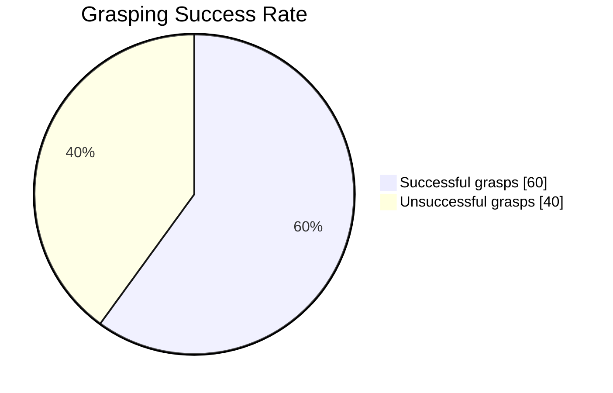

# 🤖 Design and Implementation of a Novel Grasping System for a Humanoid Robot  

  
  
  
  

---

## 📌 Overview  
This repository presents the **Master’s Thesis Project**:  
**“Design and Implementation of a Novel Grasping System for a Humanoid Robot”**,  
developed to enable **Pepper**, a humanoid robot by SoftBank Robotics, to **grasp unknown objects** without relying on external markers or additional sensors.  

The system combines **state-of-the-art computer vision** with **robotic motion planning**:  
- 🟦 **YOLO (You Only Look Once)** → real-time object detection.  
- 🟩 **Depth Anything** → monocular depth estimation for 3D perception.  
- 🟥 **Inverse Kinematics** → precise arm movement planning for grasp execution.  

Unlike traditional approaches, this work **excludes the use of fiducial markers, external depth sensors, or motion trackers**, relying solely on Pepper’s built-in cameras and actuators.  

---

## 🎯 Objectives  
- ✅ Enable Pepper to **detect and localize unknown objects** in its environment.  
- ✅ Estimate **distance and depth** using monocular vision.  
- ✅ Compute **inverse kinematics** to position the end-effector.  
- ✅ Execute grasping using Pepper’s **limited hand control** (open/close).  
- ✅ Achieve the above **within Pepper’s hardware and software constraints**.  

  

---

## 🦾 Background & Motivation  
Humans rely on **sight, touch, and proprioception** for grasping. Robots, however, depend on **cameras and sensors**. Grasping is particularly challenging for humanoid robots, where constraints in hardware and control limit precision.  

Humanoid robots are designed to **support or replace human tasks** in various fields, from assistance to entertainment.  
We distinguish between:  
- 🚶 **Biped humanoids** – full-body robots with arms and legs.  
- 🛞 **Upper-body mobile humanoids** – wheeled robots with torso, head, and arms.  

👉 Pepper belongs to the **second category**. 

  

---

## 🤖 Pepper Robot – Technical Specifications  
Pepper is a **humanoid robot** developed by **SoftBank Robotics** (formerly Aldebaran Robotics).  

### 📏 Physical Characteristics  
- Height: ~1.20 m  
- Mobility: **3-wheeled omnidirectional base**  
- Degrees of Freedom (DoF): **20 total**, with **5 per arm**  

### 👀 Vision System  
- 2 × RGB cameras (**640×480**) → located in mouth & forehead  
- Optional: stereo cameras or 3D depth sensor (our version: **stereo cameras**)  
- Frame rate: **15 fps @ 10 Hz** (non-simultaneous usage of the two RGB cameras)  

### 🖐 Hand & Sensors  
- Fingers: **cannot move individually** → hand is only fully open/closed  
- Max payload: **200 g**  
- Capacitive sensors → **upper part of the hands only**  

### 🧠 Embedded System  
- OS: **NAOqi 2.9**  
- Processor: **low-performance CPU**  
- Built-in gyroscopes & lasers (not used in this project)  
- Depth map reconstruction from stereo → **not precise with NAOqi API**  

  

---

# ⚙️ System Architecture  

The grasping system is structured into **five interconnected modules**, each responsible for a critical step in enabling Pepper to detect, localize, and grasp objects.  

---

## 🧩 System Modules  

### 1. 🟦 Object Detection  
- **Task**: Identifies the target object within images captured by Pepper’s cameras.  
- **Method**:  
  - Extracts the **bounding box** that defines the object’s location in the 2D image.  
  - Utilizes **YOLOv10-small** for efficient real-time detection.  
- **Output**: Bounding box coordinates → input for depth estimation.  

  

---

### 2. 🟩 Depth Estimation  
- **Task**: Estimates per-pixel depth from a single RGB image.  
- **Method**:  
  - Input: **Image (h × w × 3)** captured by Pepper’s camera.  
  - Output: **Depth map (h × w)** representing estimated distance of each pixel.  
  - Model used: **Depth Anything V2** (monocular-based, not multi-view).  
- **Notes**:  
  - Stereo cameras were discarded due to **calibration issues** and **poor depth maps**.  
  - Monocular estimation proved **more robust** and effective.

  

#### 🔍 How Depth Anything V2 Works  
Depth Anything V2 employs a **teacher-student training strategy**:  
1. 🧑‍🏫 **Teacher model** trained exclusively on **high-quality synthetic datasets**.  
2. 🖼 Teacher generates **pseudo-realistic depth labels** for a large set of **unannotated real images**.  
3. 🎓 **Student models** are then trained on these pseudo-labeled datasets, allowing them to **generalize to real-world scenarios**.  

  

---

### 3. 🟥 Coordinate Mapping  
- **Task**: Converts 2D object coordinates (image frame) into **3D coordinates relative to the robot base**.  
- **Output**: Object pose expressed in the robot’s coordinate system.  

---

### 4. 🟨 Path Planning  
- **Task**: Generates a **feasible trajectory** for Pepper’s manipulator to reach the target object.  
- **Method**: Iteratively adjusts Pepper’s base and arms until the object pose aligns with an **ideal grasp pose** within an acceptable error margin.  

---

### 5. 🟪 Inverse Kinematics  
- **Task**: Computes joint configurations to move Pepper’s end-effector (hand) to the desired pose.  
- **Framework**: **Playful Kinematics**  
  - Based on **Cyclic Coordinate Descent (CCD)**.  
  - Extends Pepper’s arm workspace by incorporating **3 lower-body DoF** in addition to the **5 DoF of the arm**.  
  - Provides greater flexibility and reach.  

  

---

## 🔄 Module Workflow  

To illustrate the complete process, consider grasping a **bottle**:  

  

1. 📷 **Image capture** → Pepper’s forehead camera acquires a real-time RGB frame.  
2. 🔍 **Object detection + Depth estimation** → YOLOv10 detects bounding box, Depth Anything V2 generates depth map.  
3. 📐 **Pose estimation** → Combination of bounding box + depth map gives 3D pose relative to camera.  
4. 🗺 **Coordinate mapping** → Converts camera coordinates to robot base frame.  
5. 🛣 **Path planning** → Plans trajectory towards the object.  
   - If the robot is **too far**, Pepper approaches iteratively.  
   - If the error **|po – pideal| < ε**, path planning ends.  
6. ⚙️ **Inverse Kinematics** → Calculates joint angles.  
7. ✋ **Execution** → Pepper closes its hand to grasp the object.  

---

## 🖥 System Execution Environment  

The five modules are implemented in **Python** and executed on an **external computer** instead of Pepper’s onboard processor, due to computational limitations.  

### 💻 Hardware  
- Laptop with:  
  - **Intel Core i9 CPU**  
  - **NVIDIA RTX 4060 GPU**  

### 🧩 Software Components  
The system relies on communication between **three main components**:  

1. **NAOqi APIs**  
   - Pepper’s OS: **NAOqi 2.9** (Android-based).  
   - Issue: NAOqi 2.9 **does not allow direct low-level access** to sensors/actuators.  
   - Workaround: Access **NAOqi 2.5 APIs** via a gateway.  

2. **First Flask Server**  
   - Runs **YOLOv10** and **Depth Anything V2**.  
   - Offloads heavy GPU computation (object detection & depth estimation).  

3. **Second Flask Server**  
   - Runs **Playful Kinematics** (requires **Ubuntu environment**).  
   - Developed on **Windows** → executed via **WSL (Windows Subsystem for Linux)**.  
   - Results retrieved and integrated with the main control pipeline.  

  

---

# 📊 Experimental Evaluation  

To assess the **performance of the grasping system**, we carried out a structured experimental campaign. The evaluation focused on verifying whether Pepper could **detect, approach, and grasp a bottle** under different environmental lighting conditions.  

---

## 🏗 Experimental Setup  

Two distinct environments were selected for the tests:  

1. 🏢 **Room 1 – Laboratory Room**  
   - Equipped with computers and large desks.  
   - Large window providing **natural daylight**.  

2. 💡 **Room 2 – Windowless Room**  
   - No windows.  
   - Illuminated exclusively by **artificial light**.  

---

## ✅ Definition of Success  

- **Successful grasp**: Pepper is able to **reach and lift the bottle**.  
- **Unsuccessful grasp**: Pepper is **unable to grasp or lift** the bottle.  

---

## 🔬 Test Procedure  

- **Total trials**: 30  
  - 15 trials in Room 1  
  - 15 trials in Room 2  
- Robot starts from **different initial positions** in each trial.  
- Each trial evaluated as **success** or **failure**.  

---

## 📈 Results  

- **Overall success rate**: **60%**  
- **Room-specific performance**:  
  - 🌞 Room 1 (natural light): lower success rate.  
  - 💡 Room 2 (artificial light): **66% success rate**.  
- **Observation**: Even in Room 1, when switching to **artificial light**, performance improved, approaching the values obtained in Room 2.  

## Authors
- [@Pnlalessio](https://github.com/Pnlalessio)  

---
